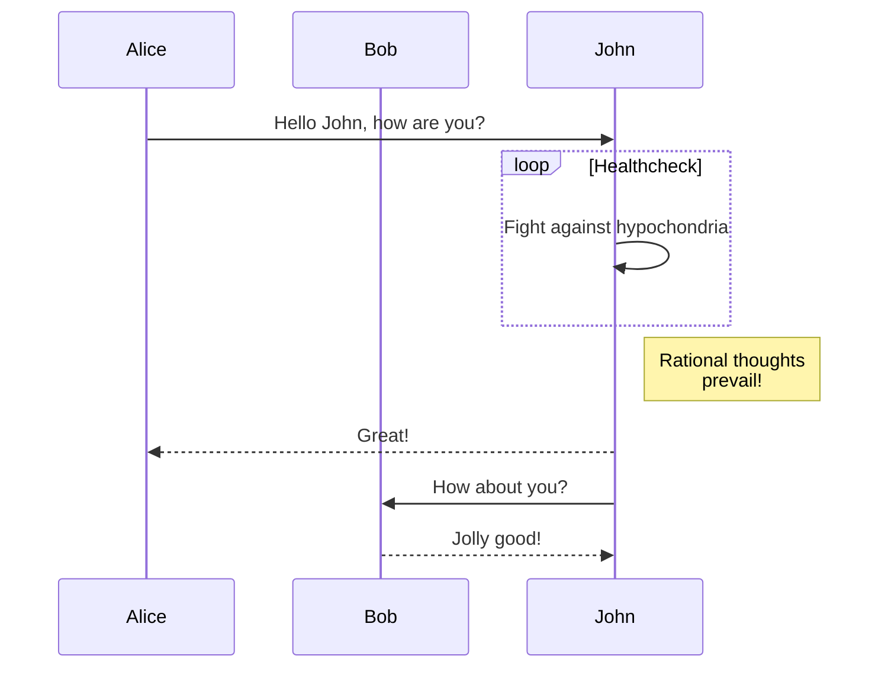
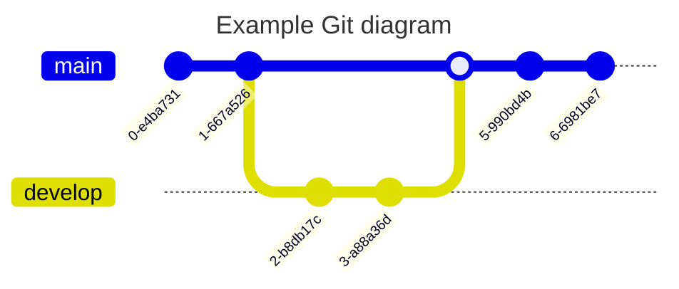

## Introduction
J'ai quand même l'impression que c'est nettement plus facile d'écrire ce blog en markdown !

## Exemple
Le _code_ est plus joli ! [^1]

```java
String toto = "toto";
System.Out.println(toto);
```

> Et je peux faire ça !




## git


## Image
On peut afficher une image aussi :


[^1]: Et voilà la note !