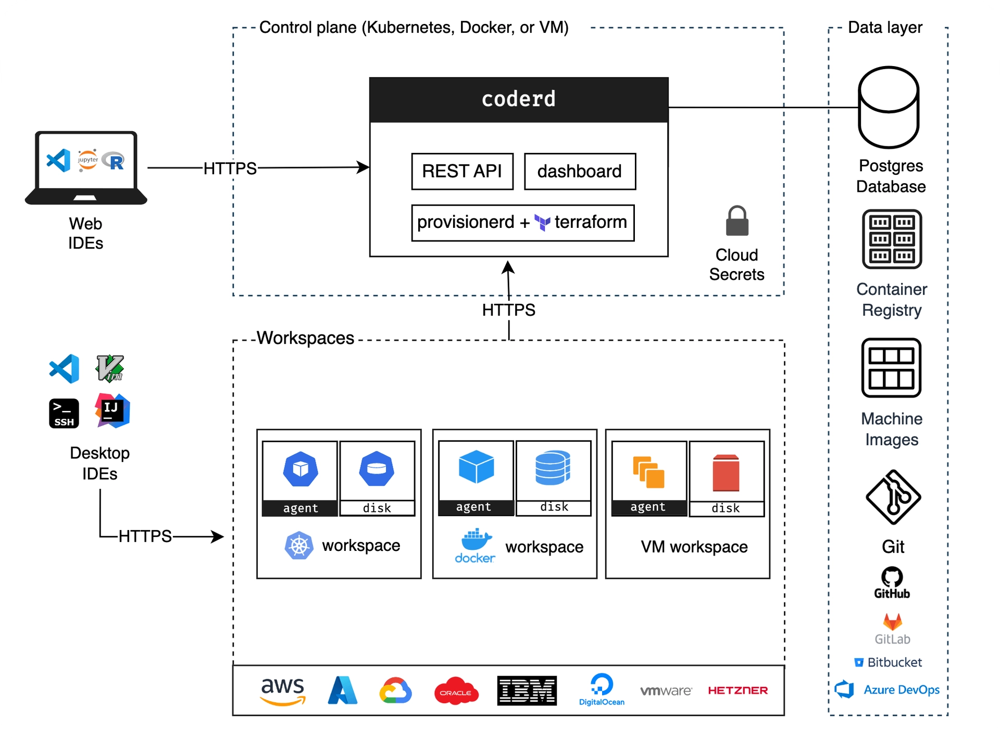

# Cloud Development Environments (CDE) - All Aboard!

In the world of software development, onboarding new developers can be a real headache. Tool installation, environment configuration, resolving incompatibilities... These are all problems that Cloud Development Environments (CDEs) promise to solve. But before diving into the world of CDEs, it's essential to understand the technologies that underpin them: DevContainers and DevFiles.

## DevContainers and DevFiles

### What is a DevContainer?

A **DevContainer** is a specification that formalizes the description of a containerized development environment. Initiated by Microsoft in 2022, this specification is now adopted by many IDEs like VS Code, IntelliJ, and many others. But long before the massive funding by Microsoft (via Github, VSCode, ...), it was **Red Hat** that was the pioneer in this field with its [DevFile](https://devfile.io/) through the [Eclipse Che](https://eclipse.dev/che/) project (adopted by the [CNCF](https://www.cncf.io/projects/devfile/) in 2022).

The philosophy is simple: develop in a container with all necessary tools pre-installed and configured. This allows you to:
- Standardize development environments across all developers
- Ensure environment reproducibility
- Simplify the onboarding of new hires

To learn more, check out the official resources:
- Official website: https://containers.dev/
- Specification: https://github.com/devcontainers/spec

### DevContainers vs Docker Compose: What's the Difference?

One might think that a DevContainer is just a simple disguised Docker Compose. In reality, it's an **abstraction layer** on top of Docker (or other runtimes like Podman) that significantly simplifies the building and execution of the container.

DevContainers bring development-specific features:
- Automatic injection of Git and SSH configuration
- Installation of additional features via "features"
- Automatic mounting of source volumes
- Lifecycle management (build, create, start, stop)

### Implementation

To set up a DevContainer, simply create a `.devcontainer` directory containing a `devcontainer.json` file that follows the specification. Here's the minimal configuration:

```json
{
	"name": "Spacesuits dev container",
	"image": "mcr.microsoft.com/devcontainers/java:1-21-bullseye"
}
```

This simple configuration is enough to get started! Microsoft already offers over a hundred ready-to-use base images (see [pre-built templates](https://containers.dev/templates)).

### Features: Customize Your Environment

**Features** are shell scripts executed during image building. They allow you to install additional tools in a declarative way:

```json
{
	"name": "Spacesuits dev container",
	"image": "mcr.microsoft.com/devcontainers/java:1-21-bullseye",
	"features": {
		"ghcr.io/devcontainers-extra/features/maven-sdkman:2": {
			"version": "3.9.11"
		}
	}
}
```

More than [a thousand features](https://containers.dev/features) are available, and you can even create your own (private or shared)!

### Advanced Configuration

DevContainers allow for very fine-grained environment configuration. Particularly through __hooks__ for executing commands at different stages of the environment build process.

```json
{
	"name": "Spacesuits dev container",
	"image": "mcr.microsoft.com/devcontainers/java:1-21-bullseye",
	"features": {
		"ghcr.io/devcontainers-extra/features/maven-sdkman:2": {
			"version": "3.9.11"
		}
	},
	"postCreateCommand": "cd backend/space-suit-back && mvn compile",
	"forwardPorts": [ 8080 ]
}
```

This configuration allows you to:
- Execute commands after container creation
- Automatically forward ports
- Define custom mount points
- Configure environment variables

### IDE Customization

DevContainers also allow you to customize the IDE itself (specific structure for each tool implementing the specification: https://containers.dev/supporting):

```json
{
	"customizations": {
		"vscode": {
			"settings": {
				"editor.tabSize": 2
			},
			"extensions": [
				"redhat.vscode-quarkus"
			]
		}
	}
}
```

This way, all developers share not only the same technical environment, but also the same IDE configuration!

## Cloud Development Environments

### History of CDEs

Cloud development environments are not new:

#### The Pioneers (2010-2014)
- **Cloud9** (2010): First major cloud IDE, revolutionary for its time but without containerization
- **Codeanywhere** (2013): Collaborative IDE in the browser

#### The Game Changer
In 2014, [Codenvy](https://www.neosoft.fr/nos-publications/blog-tech/eclipse-che-un-ide-sur-le-cloud/), based on the specification introduced by the open source project
Eclipse Che, created the first 100% cloud-oriented IDE. The idea: to be able to perform development and create a deliverable solely on cloud platforms.
It was during this period that the **DevFiles** concept was incubated. In 2019, Eclipse Che officially supported DevFiles and Codenvy was acquired by RedHat.

#### The Popularization (2019-2022)
- **RedHat OpenShift Dev Spaces** (2019 - DevFiles)
- **Microsoft GitHub Codespaces** (2020 - DevContainers): Massive adoption thanks to integration with GitHub and VScode
- **Google Cloud Workstations** (2022 - DevContainers)

### How Do CDEs Work?

There are two main operating modes for CDEs:

#### 1. Manual

With tools like **DevPod** or **Daytona**, the developer launches their own CDE. These solutions:
- Allow you to choose the provider (local environment, cloud, Kubernetes, etc.)
- Automatically configure SSH connection
- Start an SSH server at the provider to route services
- The IDE backend runs on the provider, the frontend locally

[DevPod](https://devpod.sh/) is particularly interesting because it works without a paywall and supports many providers.


*DevPod component diagram*

#### 2. Remote

Solutions like [Coder](https://coder.com/), **Gitpod** (recently renamed [Ona](https://ona.com/)), [Theia Cloud](https://theia-cloud.io/), or [Lapdev](https://lap.dev/) offer a different approach where everything is managed through a web interface.

**Coder** deserves special attention because it can be completely self-hosted. Its architecture relies on:
- A **coderd** service that manages workspace creation and machine connection
- Workspaces with limited lifetimes (configurable by admin)
- Changes are saved even if the workspace is stopped


*Simplified Coder infrastructure diagram*

## CDEs: Advantages and Disadvantages

### The Disadvantages

Let's be honest about the constraints!

- **📡 Network Access**: Requires a stable internet connection (machines can reconnect in case of disconnection)
- **🎛️ Initial Complexity**: Initial setup can be complex depending on the solution
- **💰 Cost or Dedicated Infrastructure**: Expensive SaaS solutions or need for self-hosted infrastructure
- **👶 Recent Technology**: Still room for improvement on integration

### The Advantages

On the other hand, the benefits are numerous:

- **⚡ Instant Onboarding**: New developers can work from day 0
- **🔄 Reproducible Environment**: Same versions and configurations everywhere
- **🔒 Isolation**: Source code is isolated on a server (even if it necessarily transits over the network)
- **🛠️ Centralized Configuration**: Managed by the DevOps team
- **💻 Lightweight Machines**: No more need for powerful machines for developers

### For What Audience?

CDEs are particularly suitable for:

- **Large Teams**: Large-scale standardization
- **High Turnover**: Simplified onboarding
- **Complex Configuration**: Environments difficult to reproduce locally
- **Critical Security**: Sensitive code that must not leave the infrastructure
- **Technical Training**: Pre-installed ephemeral environment
- **Open-Source Projects**: Allows contributors to get started quickly

## Conclusion

Cloud Development Environments represent a major evolution in the way we develop software. By leveraging DevContainers and DevFiles, they offer an elegant solution to onboarding and environment standardization problems.

Whether you choose a "manual" solution like DevPod to maintain control, or a managed solution like Coder or GitHub Codespaces to delegate infrastructure management, CDEs promise to radically transform the development experience.

The technology is still young, but its growing adoption by cloud giants and innovative companies shows that we are only beginning to glimpse the potential of cloud development environments.

## Further Reading

- 🎬 [Develop on a Toaster Thanks to Coder](https://www.youtube.com/watch?v=S9-C4ToXonw&list=PLuZ_sYdawLiWenx-X315dfZNOaliVnSTY/)
- 📄 [Coder Infrastructure Documentation](https://coder.com/docs/admin/infrastructure)
- 📄 [Introduction to Eclipse Che](https://eclipse.dev/che/docs/stable/overview/introduction-to-eclipse-che/)
- 📄 [Awesome DevContainers](https://github.com/manekinekko/awesome-devcontainers) - Template List
- 🌐 [DevContainers Specification](https://containers.dev/)
