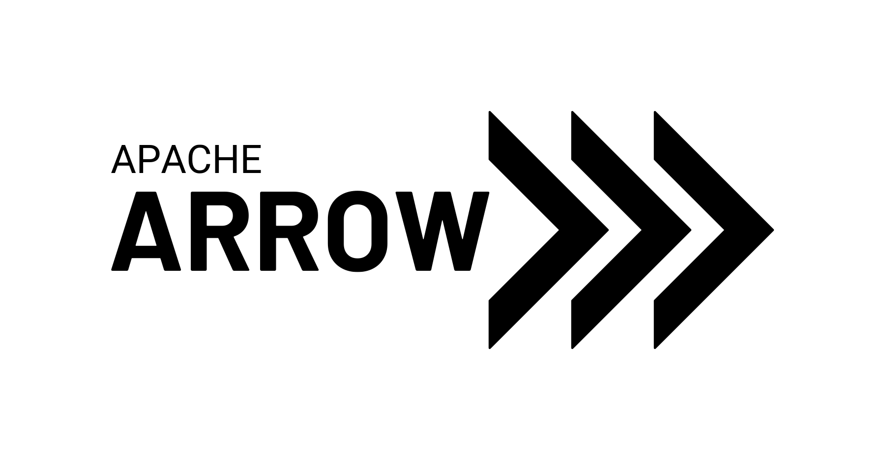

From April 16th to 18th was held **the** annual developers' gathering: Devoxx France! It was an opportunity for me and a delegation of colleagues to go to Paris, more precisely to the congress center, to attend and give multiple talks.

Here's my top 3 presentations.

## 🔧 How to Debug in Production? - [Jean-Philippe Bempel](https://www.linkedin.com/in/jeanphilippebempel/)

    

**Jean-Philippe Bempel** is a performance expert and Java Champion at Datadog. During his talk, we discovered advanced techniques for debugging in production environments.
Leveraging the JVM's [instrumentation API](https://docs.oracle.com/javase/8/docs/api/java/lang/instrument/Instrumentation.html), available since JDK 1.5, Jean-Philippe demonstrated how to use a Java Agent to transform bytecode on the fly. This method allows adding advanced features like OpenTelemetry metrics without restarting the application, while maintaining low overhead (though still present!). The practical example showcased the effectiveness of this approach in solving production issues in real-time.

**To learn more:**
* Jean-Philippe's [website](https://jpbempel.github.io/) (in french), to follow his adventures in the JVM internals!
* OpenTelemetry's [documentation](https://opentelemetry.io/docs/zero-code/java/agent/) about the Java instrumentation agent
* or this [article](https://www.elastic.co/observability-labs/blog/extensions-opentelemetry-java-agent) from elastic on the subject

## 🏹 Apache Arrow, High-Performance and Interoperable Data Analysis - [Sylvain Wallez](https://www.linkedin.com/in/swallez/)

    

[Apache Arrow](https://arrow.apache.org/) is a data model optimized for performance. **Sylvain Wallez**, developer and architect, Apache Foundation member, explained how Arrow eliminates data serialization and deserialization time by writing to continuous shared memory areas, enabling [**zero-copy**](https://medium.com/@emreeaydiinn/zero-copy-reads-explained-8d54e6084857) reads.

Furthermore, Arrow doesn't handle recursive data, requiring normalization if present. Sylvain also presented the **Arrow stack**, a set of tools to fully leverage Arrow's capabilities, **Arrow Flight** for network exchanges, and the **DataFusion** SQL engine.

The talk highlighted Arrow's integration with Elasticsearch, featuring practical demonstrations such as using Elasticsearch with Pandas in Python, ingesting data from Parquet files, and executing SQL queries on heterogeneous sources with DataFusion. The presentation concluded with an impressive SQL "join" between Postgres and Elasticsearch, showcasing Arrow's power and interoperability.

The slides are available [here](https://docs.google.com/presentation/d/e/2PACX-1vRzNDZkA2e5QHZdAoD3Flcm5xF10a-AZ6VmsXIknVRlFZ4hXP1SVh7kR41ACCEQYvAWecgy0Fbf-slE/pub?pli=1&slide=id.p).

## 🥊 Bring the Action: Using GraalVM in Production - [Alina Yurenko](https://www.linkedin.com/in/alinayurenko)

    

**Note**: This was my favorite talk!

**Alina Yurenko**, developer advocate at Oracle, started by demonstrating that migrating from JVM to GraalVM is surprisingly simple: a [Maven plugin](https://graalvm.github.io/native-build-tools/latest/end-to-end-maven-guide.html) is sufficient for this transition. She shared valuable tips for optimizing development with native compilation, particularly using the `-O0` parameter to significantly reduce compilation time - essential for improving developer experience.

Alina also addressed the challenges of using libraries that rely on reflection, a feature not directly supported in native compilation. She presented several tools and techniques to work around this limitation and provided [this list](https://www.graalvm.org/native-image/libraries-and-frameworks/) of natively compatible libraries.

One of the most impressive optimizations presented was "Profile Guided Optimization" (**PGO**), which can outperform JVM even after its warm-up time (with tests to prove it). I also (re)discovered the most suitable garbage collectors for further optimizing execution speed (incidentally, [**G1**](https://docs.oracle.com/en/java/javase/22/gctuning/garbage-first-g1-garbage-collector1.html) remains the fastest).

Finally, Alina shared a preview of GraalVM's future developments, including WebAssembly compilation capabilities and the introduction of **Native Image Layers** to drastically improve compilation speed. These advances promise to make GraalVM even more powerful and versatile in production environments, which I'm quite excited about!

## See You Next Year!
This edition of Devoxx France -my first one- was absolutely fantastic. Between the numerous discussions, fascinating talks, and the pleasure of being able to talk about [Mockoon](https://blog.hot-coffee.dev/en/blog/mockoon_conf/) myself, the event was rich in emotions!
I only hope for one thing: to be able to say "see you next year" at Devoxx...

