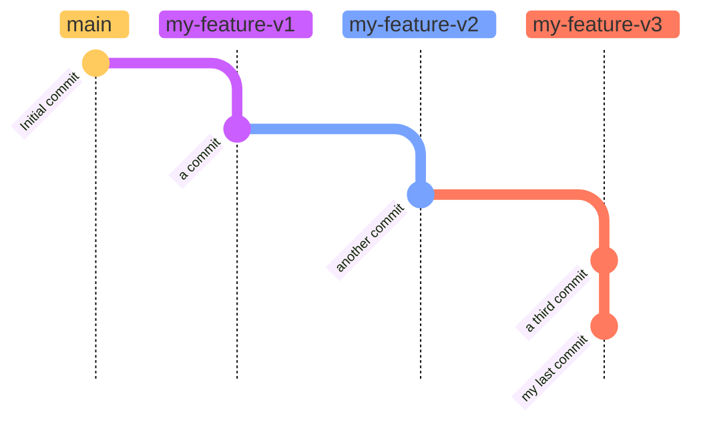
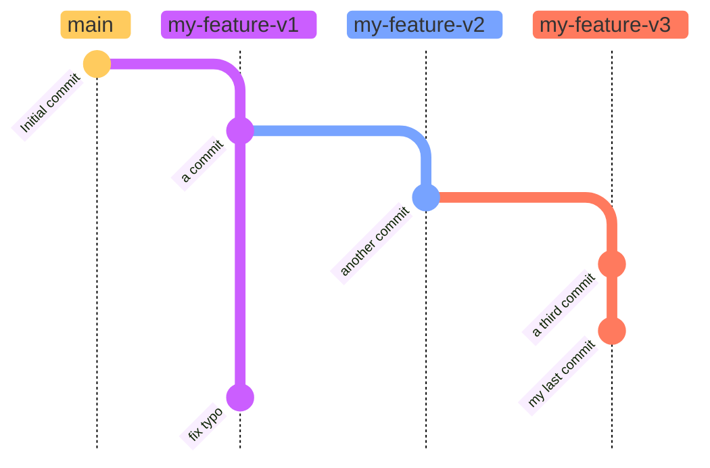
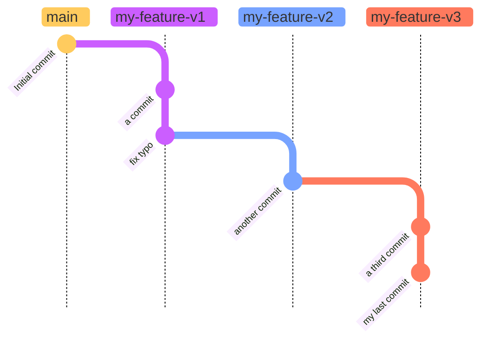
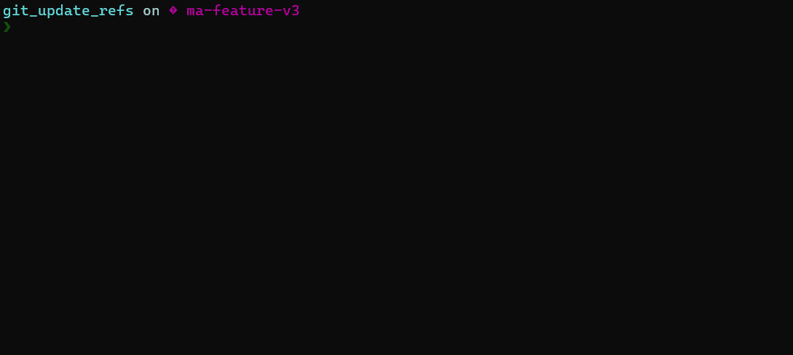

When working on a versioned project, it is relatively common to end up with a "stack" of branches. What could be more frustrating than having to rebase all the other branches on top of the first one when updating it? This process becomes even more tedious when the number of branches is high or when they are regularly modified.

Git version 2.38[^1] introduces a solution to this problem: the `update-refs` rebase option.

## Stack?
Branch stacking is a way to break down important features, allowing for smaller pull requests. In the example below, three branches dependent on each other have been created, allowing "my feature" to be divided into three distinct blocks.

> The assumption here is that when each of these branches is individually merged into the `main` branch, the code will still be functional, as it has been appropriately divided.

Let's say a small typo was made in the commit of the `my-feature-v1` branch. A second commit needs to be added to fix the issue, resulting in the following history:

In this situation, the only solution to update `my-feature-v2` and `my-feature-v3` is to checkout and rebase v2 on v1, then v3 on v2.

This cumbersome process is remedied by the `update-refs` rebase option.

## The solution
### update-refs
The goal of this option is to automatically update the _n_ branches on which the branch being rebased depends.

Thus, in our case, we can simply checkout our `my-feature-v3` branch and run the command `git rebase my-feature-v1 --update-refs`. With this option, Git updates not only the v3 branch but also the v2 branch to preserve the history. The result of this operation is as follows:

**In practice:**

### Updating the Remote Repository
Even if the branches being manipulated have already been pushed to the remote repository, it is possible to update all of them in a single command: `git push --force-with-lease origin my-feature-v1 my-feature-v2 my-feature-v3`

> Here, a specific `force push` is used to preserve the remote history[^2].

### Global Activation
Why not always use the `update-refs` option during a rebase? The Git team asked themselves the same question and decided to include this possibility in the configuration. Thus, `git config --global rebase.updateRefs true` activates the option globally for each of your rebases.

### In Summary
* `git rebase {my-branch} --update-refs` updates a branch and all its dependencies
* `git push --force-with-lease origin my-branch-1 my-branch-2 my-branch-n` pushes the update of these branches to the remote repository

Happy _rebasing_!

[^1]: The release note is available [here](https://github.blog/2022-10-03-highlights-from-git-2-38/#rebase-dependent-branches-with-update-refs)

[^2]: See the [use case](https://blog.stack-labs.com/code/git_force_with_lease/)
