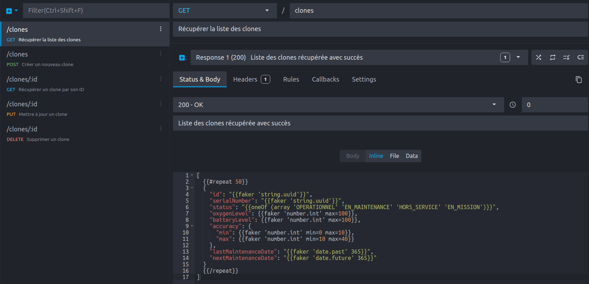
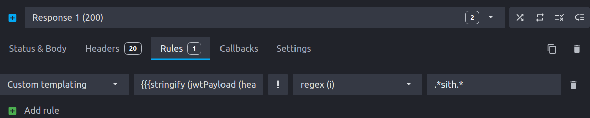

In modern application development, interaction with web services has become essential. However, what happens when these services are unavailable, still under development, or simply unstable? This is where Mockoon comes in to save the day.

## What is Mockoon?

Mockoon is a powerful tool for simulating web services. But before diving into its features, let's clarify the concept:

> A **mock** is a controlled imitation of a real component. In the context of web services, it can be an HTTP response containing mock data.

Mockoon comes in two forms:
- **A Graphical User Interface (GUI)**: to visually configure your mocks
- **A Command Line Interface (CLI)**: for integration into your CI/CD pipelines or deployment environments

### Mockoon's GUI


The Mockoon interface is organized around key concepts:

- **Environments**: Independent spaces representing one or more web services
- **Endpoints**: The routes of your simulated web service, each configured to respond to specific requests
- **Endpoint configuration**: HTTP verb (GET, POST, etc.), path, headers, and other parameters
- **Response configuration**: HTTP status code, headers, body content (with template support)

This interface allows you to set up a functional mock in just a few clicks, with little to no code writing required.

## Feature Demonstration

### Import from Swagger/OpenAPI

One of Mockoon's strengths is its ability to [import OpenAPI interface contracts](https://mockoon.com/docs/latest/openapi/import-export-openapi-format/). This feature allows you to:

1. Import an existing specification file
2. Automatically create all defined routes
3. Generate coherent random data using [FakerJS](https://fakerjs.dev/)
4. Customize these responses with the integrated templating system

#### Example
This [OpenAPI interface contract](spacesuit-api.yaml) can be imported by Mockoon, which will create HTTP routes to reproduce the behavior of a mock web service respecting the contract:



In Mockoon:


### Template
The request body can be dynamically configured using a [templating system](https://mockoon.com/docs/latest/templating/overview/). In our example, a possible configuration is:


[
  {{#repeat 50}}
  {
    "id": "{{faker 'string.uuid'}}",
    "serialNumber": "{{faker 'string.uuid'}}",
    "status": "{{oneOf (array 'OPERATIONAL' 'IN_MAINTENANCE' 'OUT_OF_ORDER' 'ON_MISSION')}}",
    "oxygenLevel": {{faker 'number.int' max=100}},
    "batteryLevel": {{faker 'number.int' max=100}},
    "accuracy": {
      "min": {{faker 'number.int' min=0 max=20}},
      "max": {{faker 'number.int' min=20 max=30}}
    },
    "lastMaintenanceDate": "{{faker 'date.past' 365}}",
    "nextMaintenanceDate": "{{faker 'date.future' 365}}"
  }
  {{/repeat}}
]


* `repeat` is one of Mockoon's helpers and allows repeating a block multiple times
* `faker` is a JavaScript library used to produce mock data
* the `oneOf` and `array` helpers allow selecting one element from a predefined list, to match possible enum values

#### Result
This endpoint now generates this type of response on `http://localhost:3000/clones/`:

```json
[
  {
    "id": "6681a40a-2d88-4e86-82f4-fb84846cb18c",
    "serialNumber": "c539eee6-c14b-446d-9b7e-5773e8dd95f5",
    "status": "OUT_OF_ORDER",
    "oxygenLevel": 3,
    "batteryLevel": 7,
    "accuracy": {
      "min": 3,
      "max": 22
    },
    "lastMaintenanceDate": "Fri Nov 22 2024 12:25:07 GMT+0100 (Central European Standard Time)",
    "nextMaintenanceDate": "Thu Aug 21 2025 21:07:31 GMT+0200 (Central European Summer Time)"
  },
  {
    "id": "7810f31f-cec1-4dd3-9f38-c963d9127ddb",
    "serialNumber": "17411fd1-139e-441c-bd7c-95aa1dc288de",
    "status": "IN_MAINTENANCE",
    "oxygenLevel": 17,
    "batteryLevel": 86,
    "accuracy": {
      "min": 17,
      "max": 23
    },
    "lastMaintenanceDate": "Sun Jan 26 2025 10:55:56 GMT+0100 (Central European Standard Time)",
    "nextMaintenanceDate": "Wed Mar 11 2026 08:46:19 GMT+0100 (Central European Standard Time)"
  },
  ...
]
```

### Data Buckets

Data buckets are data repositories that allow you to store and reuse information across different routes. They are particularly useful for:

- Maintaining data consistency between calls
- Implementing features like pagination
- Simulating complete [CRUD operations](https://mockoon.com/docs/latest/api-endpoints/crud-routes/)

In our case, we can simply create a data bucket from the data generated on the `/clones` endpoint. Then, creating a CRUD route from this data bucket opens the way to using all common HTTP verbs (GET, POST, PUT, PATCH, DELETE).
Moreover, between each action, the data bucket's state is updated, which brings the mock's behavior closer to that of a real web service. Restarting the environment resets the data bucket's state.

### Rules and Filters

Mockoon allows you to apply rules and filters to customize responses based on the request content:



## Deploying the Mock Server

Once your mock environments are ready, Mockoon offers several deployment options:

### Via npm

```bash
# Installation
npm install -g @mockoon/cli

# Start with one environment
mockoon-cli start --data clones.json
```

To deploy multiple environments at once:

```bash
mockoon-cli start \
 --data clones.json planets.json \
 --port 3000 3001
```

### Via Container

Mockoon can generate a [Containerfile](https://www.mankier.com/5/Containerfile) adapted to your configuration:

```bash
mockoon-cli dockerize \
 --data clones.json planets.json \
 --output ./Containerfile
```

Then you just need to build and run it:

```bash
docker build -t clones_mocks .
docker run -d -p 3000:3000 -p 3001:3001 clones_mocks
```

### Via GitHub Actions

Mockoon also provides an official GitHub action: [`mockoon/cli-action@v2`](https://github.com/marketplace/actions/mockoon-cli)

## Mockoon vs Wiremock

If you're already familiar with [Wiremock](https://wiremock.org/), you might be wondering why choose Mockoon?
Here are my pros and cons:

- ✅ Faster to set up
- ✅ Easier to configure thanks to its intuitive graphical interface
- ❌ Fewer advanced features than Wiremock (but covers most common needs)

## Contributing to the Project

Mockoon is an evolving open-source project. You can contribute or follow its development on [GitHub](https://github.com/mockoon).

## Conclusion

Mockoon represents an elegant and efficient solution for mocking web services, accessible to both beginners and experienced developers. Its flexibility, simplicity, and power make it an essential tool in any developer's arsenal.

Whether you're looking to develop your frontend independently from the backend, deploy an isolated testing environment, or simply work offline, Mockoon is there to make your task easier!