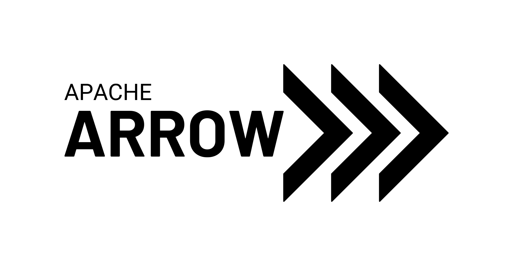
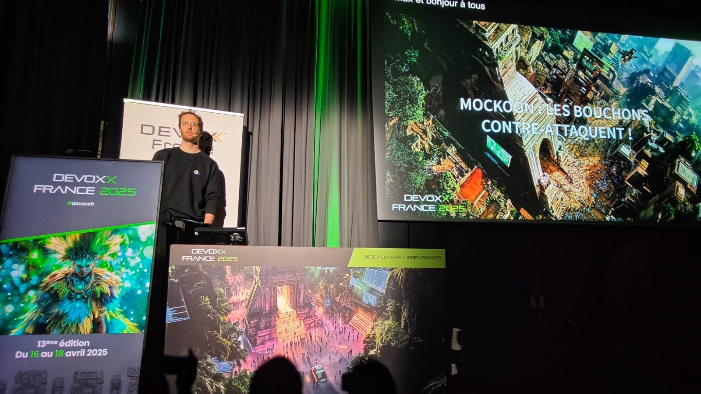

Du 16 au 18 avril se tenait **la** grand-messe annuelle des développeurs : Devoxx France ! L'occasion pour moi ainsi qu'une belle délégation de collègues de nous rendre à Paris, au centre des congrès plus exactement, pour suivre et donner de multiples conférences. 

Voici mon top 3 de ces présentations.

## 🔧 Comment debugger en production ? - [Jean-Philippe Bempel](https://www.linkedin.com/in/jeanphilippebempel/)

    

**Jean-Philippe Bempel** est expert en performance et Java Champion chez Datadog. Lors de sa conférence, nous avons découvert des techniques avancées pour le debugging en environnement de production. 
En s'appuyant sur [l'API d'instrumentation](https://docs.oracle.com/javase/8/docs/api/java/lang/instrument/Instrumentation.html) de la JVM, disponible depuis le JDK 1.5, Jean-Philippe a démontré comment utiliser un Java Agent pour transformer le bytecode à la volée. Cette méthode permet d'ajouter des fonctionnalités avancées comme des métriques OpenTelemetry sans redémarrer l'application, tout en maintenant un faible overhead (quoique présent tout de même !). L'exemple pratique présenté a mis en lumière l'efficacité de cette approche pour résoudre des problèmes de production en temps réel.

**Pour aller plus loin :**
* le [site](https://jpbempel.github.io/) de Jean-Philippe, pour suivre ses aventures dans les entrailles de la JVM ! 
* la [documentation](https://opentelemetry.io/docs/zero-code/java/agent/) d'OpenTelemetry sur l'agent Java d'instrumentation du code
* ou encore, [cet article](https://www.elastic.co/observability-labs/blog/extensions-opentelemetry-java-agent) d'elastic sur le sujet

## 🏹 Apache Arrow, l’analyse de données haute performance et interopérable - [Sylvain Wallez](https://www.linkedin.com/in/swallez/)

    

[Apache Arrow](https://arrow.apache.org/) est un modèle de données optimisé pour la performance. **Sylvain Wallez**, développeur et architecte, membre de la Fondation Apache, nous a expliqué comment Arrow permet de supprimer le temps de sérialisation et désérialisation des données, en les écrivant dans des zones mémoire partagées continues, ce qui permet des lectures [**zero-copy**](https://medium.com/@emreeaydiinn/zero-copy-reads-explained-8d54e6084857).

Par ailleurs, Arrow ne gère pas les données récursives, ce qui nécessite de les normaliser si elles existent. Sylvain a également présenté la **stack Arrow**, un ensemble d'outils permettant d'exploiter pleinement les capacités d'Arrow, **Arrow Flight** pour les échanges réseau ou encore le moteur SQL **DataFusion**.

La conférence a mis en lumière l'intégration d'Arrow dans Elasticsearch, avec des démonstrations pratiques telles que l'utilisation d'Elasticsearch avec Pandas en Python, l'ingestion de données depuis des fichiers Parquet, et l'exécution de requêtes SQL sur des sources hétérogènes avec DataFusion. La présentation s'est conclue par un impressionnant "join" SQL entre Postgres et Elasticsearch, illustrant la puissance et l'interopérabilité d'Arrow.

Les slides de la conférences sont disponibles [ici](https://docs.google.com/presentation/d/e/2PACX-1vRzNDZkA2e5QHZdAoD3Flcm5xF10a-AZ6VmsXIknVRlFZ4hXP1SVh7kR41ACCEQYvAWecgy0Fbf-slE/pub?pli=1&slide=id.p).

## 🥊 Bring the Action: Using GraalVM in Production - [Alina Yurenko](https://www.linkedin.com/in/alinayurenko)

    

**Attention** : il s'agit de ma conférence préférée ! 

**Alina Yurenko**, developer advocate chez Oracle, a commencé par démontrer que migrer de la JVM à GraalVM est étonnamment simple : un [plugin Maven](https://graalvm.github.io/native-build-tools/latest/end-to-end-maven-guide.html) suffit pour effectuer cette transition. Elle a partagé des astuces précieuses pour optimiser le développement avec la compilation native, notamment l'utilisation du paramètre `-O0` pour réduire considérablement le temps de compilation; essentiel pour améliorer l'expérience du développeur.

Alina a également abordé les défis liés à l'utilisation de bibliothèques faisant appel à la réflexion, une fonctionnalité non supportée directement en compilation native. Elle a présenté plusieurs outils et techniques pour contourner cette limitation et a fourni [cette liste](https://www.graalvm.org/native-image/libraries-and-frameworks/) des bibliothèques compatibles nativement.

L'une des optimisations les plus impressionnantes présentées était le "Profile Guided Optimization" (**PGO**), qui permet de surpasser les performances de la JVM même après son temps de chauffe (tests à l'appui). J'ai également pu (re)découvrir les garbage collectors les plus adaptés pour optimiser encore davantage la vitesse d'exécution (en l'occurrence le plus rapide reste [**G1**](https://docs.oracle.com/en/java/javase/22/gctuning/garbage-first-g1-garbage-collector1.html)).

Enfin, Alina a partagé un aperçu des futures évolutions de GraalVM, notamment la possibilité de compiler en WebAssembly et l'introduction des **Native Image Layers** pour améliorer drastiquement la vitesse de compilation. Ces avancées promettent de rendre GraalVM encore plus performant et polyvalent dans les environnements de production, ce qui n'est pas pour me déplaire !

## A l'année prochaine !
Cette édition de Devoxx France -une première pour moi- était absolument formidable. Entre les nombreuses discussions, les conférences passionnantes et le plaisir de pouvoir moi-même parler de [Mockoon](https://blog.hot-coffee.dev/blog/mockoon_conf/), l'évènement a été riche en émotions !
Je n'espère qu'une chose : pouvoir dire "à l'année prochaine" à Devoxx... 

