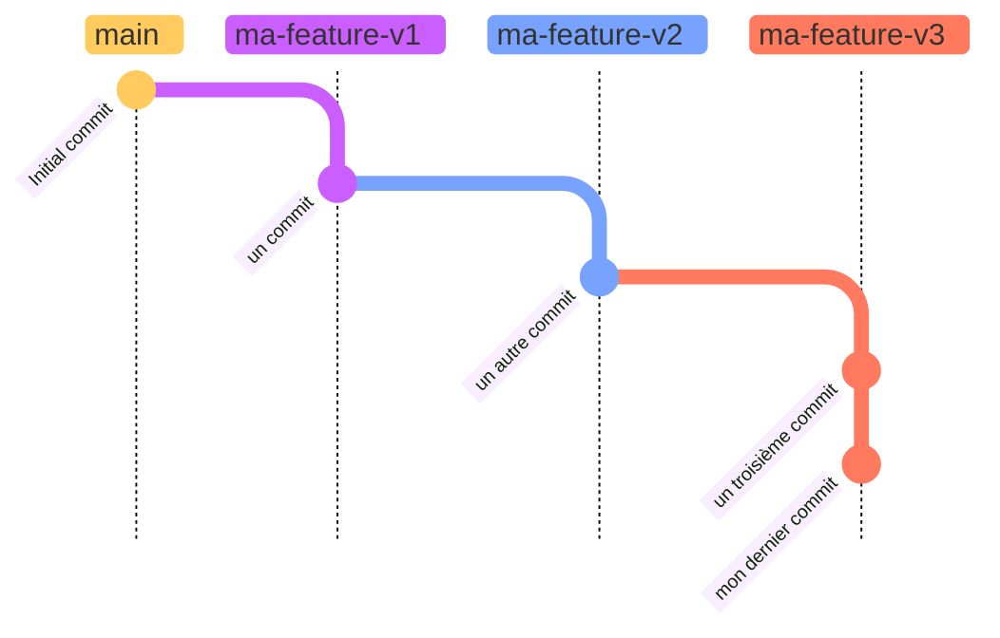
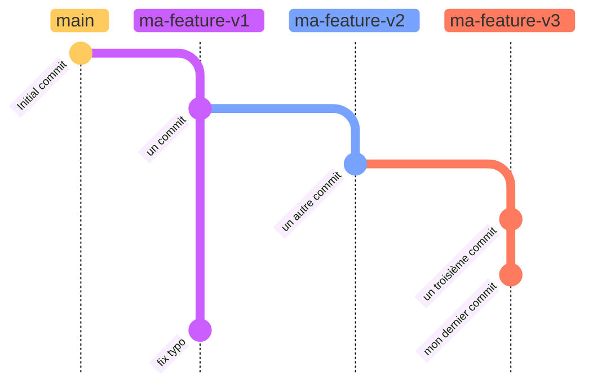
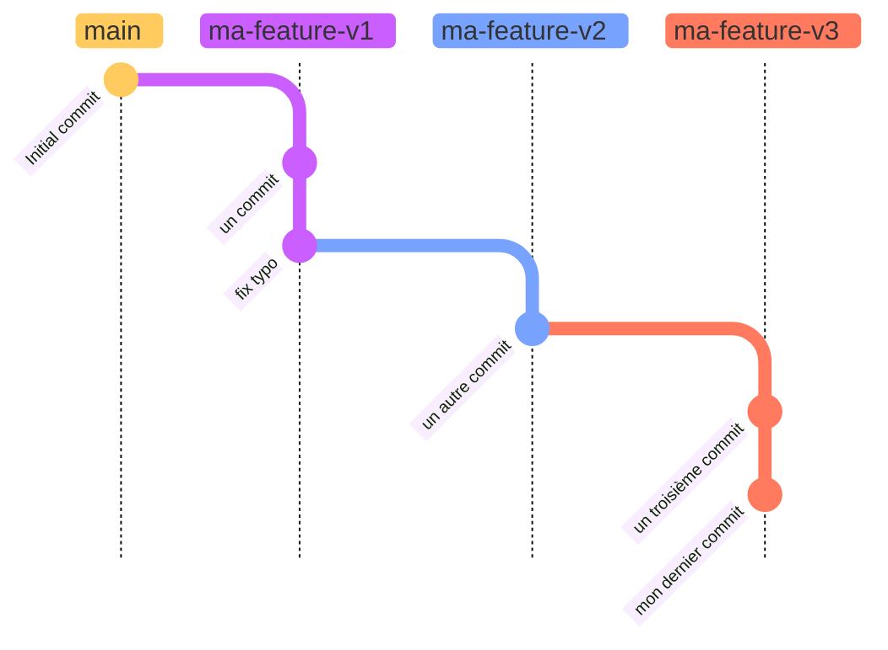
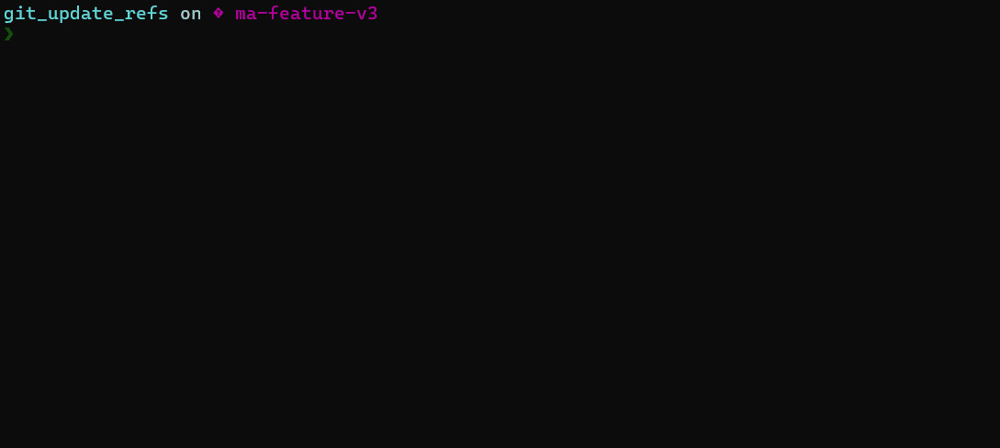

Lorsque l'on travaille sur un projet versionné, il est relativement commun de se retrouver avec un "empilement" de branches. Quoi de plus frustrant, lorsque l'on met à jour la première de ces branches, que de _rebase_ toutes les autres par-dessus ? Ce processus est d'autant plus fastidieux que le nombre de branches est élevé ou qu'on les modifie régulièrement.

La version 2.38 de git[^1] apporte une solution à ce problème : l'option de rebase `update-refs`.

## Empilement ?
L'empilement de branches est une façon de morceler des _features_ importantes, ce qui permet notamment de créer de plus petites _pull request_.
Dans l'exemple ci-dessous, on a créé trois branches dépendantes les unes des autres, permettant de découper "ma feature" en trois blocs distincts.

> On part ici du principe que lorsque chacune de ces branches sera individuellement _merge_ dans la branche `main`, le code sera toujours fonctionnel, car il aura été découpé de manière adéquate. 

Admettons qu'on l'on ait fait une petite faute de frappe dans le commit de la branche `ma-feature-v1`. Un deuxième commit doit être ajouté pour régler le problème et on se retrouve alors avec l'historique suivant :

Dans cette situation, une seule solution pour remettre à jour `ma-feature-v2` et `ma-feature-v3` : _checkout_ et _rebase_ v2 sur v1, puis v3 sur v2. 

C'est à ce processus fastidieux que remédie l'option de rebase `update-refs`.

## La solution
### update-refs
L'objectif de cette option est de mettre automatiquement à jour les _n_ branches dont dépend la branche que l'on cherche à _rebase_.

Ainsi, dans notre cas, on peut simplement _checkout_ notre branche `ma-feature-v3` et lancer la commande `git rebase ma-feature-v1 --update-refs`. Grâce à cette option, git met à jour non seulement la branche v3, mais également la v2, pour préserver l'historique. Le résultat de cette opération est le suivant :

**En pratique :**

### Mise à jour du dépôt distant
Même si les branches que l'on manipule ont déjà été poussées sur le dépôt distant, il est possible de toutes les mettre à jour en une seule commande : `git push -f origin ma-feature-v1 ma-feature-v2 ma-feature-v3`

> L'option -f est nécessaire puisque des modifications d'historiques ont été faites lors du _rebase_

### Activation globale
Pourquoi ne pas toujours utiliser l'option `update-refs` lors d'un _rebase_ ? L'équipe de git s'est posé la même question et a décidé d'inclure cette possibilité dans la configuration. 
Ainsi, `git config --global rebase.updateRefs true` active l'option globalement, pour chacun de vos _rebase_.

### En résumé
* `git rebase {ma-branche} --update-refs` met à jour une branche et toutes ses dépendances
* `git push -f origin ma-branche-1 ma-branche-2 ma-branche-n` pousse la mise à jour de ces branches sur le dépôt distant
  

Joyeux _rebase_ !

[^1]: La note de version est diponible [ici](https://github.blog/2022-10-03-highlights-from-git-2-38/#rebase-dependent-branches-with-update-refs)