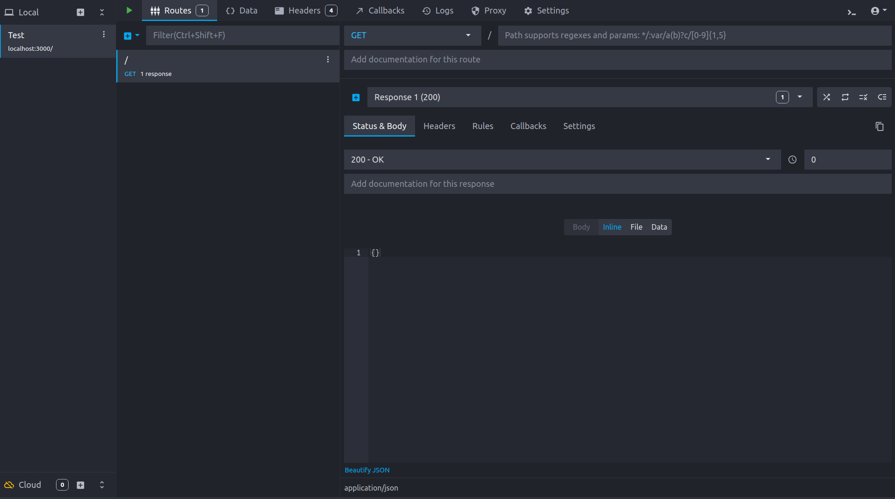
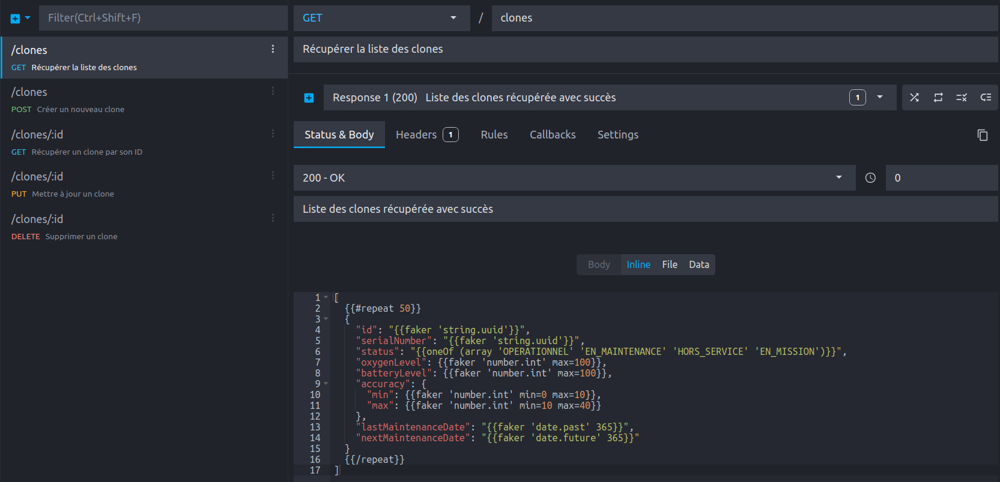
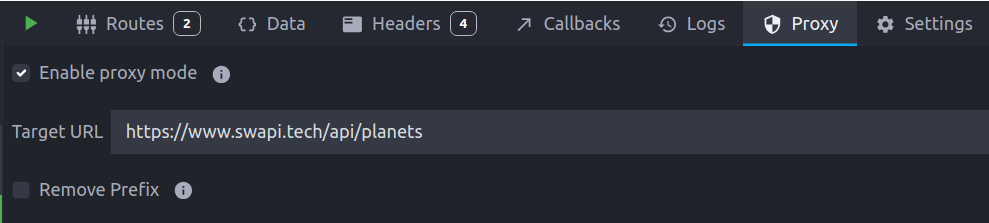
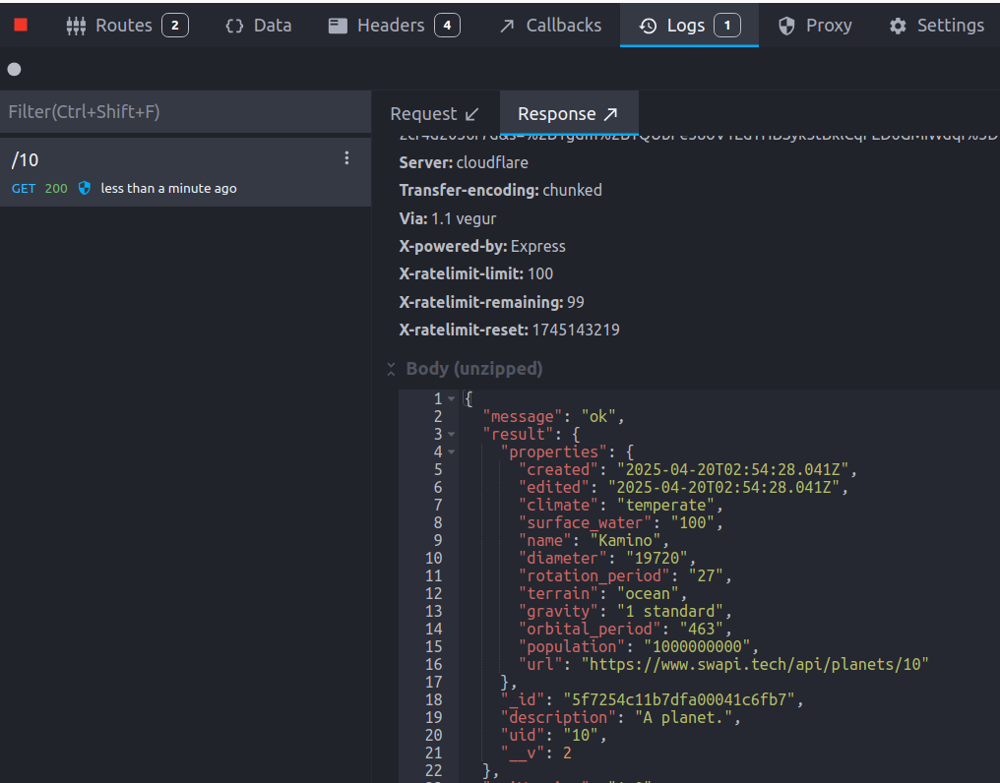
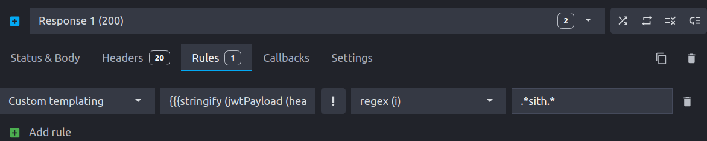

Dans le développement moderne d'applications, l'interaction avec des webservices est devenue incontournable. Cependant, que se passe-t-il lorsque ces services ne sont pas disponibles, en cours de développement eux aussi, ou simplement instables ? C'est là que Mockoon entre en scène pour sauver la situation.

## Qu'est-ce que Mockoon ?

Mockoon est un outil puissant permettant de simuler des webservices. Mais avant de plonger dans ses fonctionnalités, clarifions le concept :

> Un **mock** (ou bouchon) est une imitation contrôlée d'un composant réel. Dans le contexte des webservices, il peut s'agir d'une réponse HTTP contenant des données factices. 

Mockoon se présente sous deux formes :
- **Une interface graphique (GUI)** : pour configurer visuellement vos mocks
- **Une interface en ligne de commande (CLI)** : pour l'intégration dans vos pipelines de CI/CD ou environnements de déploiement

### L'interface graphique de Mockoon


L'interface de Mockoon est organisée autour de concepts clés :

- **Environnements** : Espaces indépendants représentants un ou plusieurs webservices
- **Endpoints** : Les routes de votre webservice simulé, chacune configurée pour répondre à des requêtes spécifiques
- **Configuration des endpoints** : Verbe HTTP (GET, POST, etc.), chemin, en-têtes, et autres paramètres
- **Configuration des réponses** : Code de statut HTTP, en-têtes, contenu du body (avec support de templates)

Cette interface permet de mettre en place un mock fonctionnel en quelques clics, sans écrire (ou presque) une seule ligne de code.

## Démonstration des fonctionnalités

### Import depuis Swagger/OpenAPI

L'un des atouts de Mockoon est sa capacité à [importer des contrats d'interface OpenAPI](https://mockoon.com/docs/latest/openapi/import-export-openapi-format/). Cette fonctionnalité permet de :

1. Importer un fichier de spécification existant
2. Créer automatiquement toutes les routes définies
3. Générer des données aléatoires cohérentes grâce à [FakerJS](https://fakerjs.dev/)
4. Personnaliser ces réponses avec le système de templating intégré

#### Exemple
Ce [contrat d'interface open API](spacesuit-api.yaml) peut être importé par Mockoon, qui créera des routes HTTP permettant de reproduire le comportement d'un webservice factice respectant le contrat :



Dans Mockoon :


### Template
Le body des requêtes peut être configuré dynamiquement à l'aide d'un [système de templating](https://mockoon.com/docs/latest/templating/overview/). Dans notre exemple, une configuration possible est la suivante : 


[
  {{#repeat 50}}
  {
    "id": "{{faker 'string.uuid'}}",
    "serialNumber": "{{faker 'string.uuid'}}",
    "status": "{{oneOf (array 'OPERATIONNEL' 'EN_MAINTENANCE' 'HORS_SERVICE' 'EN_MISSION')}}",
    "oxygenLevel": {{faker 'number.int' max=100}},
    "batteryLevel": {{faker 'number.int' max=100}},
    "accuracy": {
      "min": {{faker 'number.int' min=0 max=20}},
      "max": {{faker 'number.int' min=20 max=30}}
    },
    "lastMaintenanceDate": "{{faker 'date.past' 365}}",
    "nextMaintenanceDate": "{{faker 'date.future' 365}}"
  }
  {{/repeat}}
]


* `repeat` fait partie des helpers de Mockoon et permet de répéter plusieurs fois un block
* `faker` est une librairie JavaScript utilisée pour produire des données factices
* les helpers `oneOf` et `array` permettent ici de ne renvoyer qu'un élément d'une liste prédéfinie, pour correspondre aux valeurs possibles d'une enum

#### Résultat
Cet endpoint permet désormais de générer une réponse de ce type sur `http://localhost:3000/clones/` :

```json
[
  {
    "id": "6681a40a-2d88-4e86-82f4-fb84846cb18c",
    "serialNumber": "c539eee6-c14b-446d-9b7e-5773e8dd95f5",
    "status": "HORS_SERVICE",
    "oxygenLevel": 3,
    "batteryLevel": 7,
    "accuracy": {
      "min": 3,
      "max": 22
    },
    "lastMaintenanceDate": "Fri Nov 22 2024 12:25:07 GMT+0100 (heure normale d’Europe centrale)",
    "nextMaintenanceDate": "Thu Aug 21 2025 21:07:31 GMT+0200 (heure d’été d’Europe centrale)"
  },
  {
    "id": "7810f31f-cec1-4dd3-9f38-c963d9127ddb",
    "serialNumber": "17411fd1-139e-441c-bd7c-95aa1dc288de",
    "status": "EN_MAINTENANCE",
    "oxygenLevel": 17,
    "batteryLevel": 86,
    "accuracy": {
      "min": 17,
      "max": 23
    },
    "lastMaintenanceDate": "Sun Jan 26 2025 10:55:56 GMT+0100 (heure normale d’Europe centrale)",
    "nextMaintenanceDate": "Wed Mar 11 2026 08:46:19 GMT+0100 (heure normale d’Europe centrale)"
  },
  ...
]
```

### Data Buckets

Les data buckets sont des réservoirs de données qui permettent de stocker et de réutiliser des informations à travers différentes routes. Ils sont particulièrement utiles pour :

- Maintenir la cohérence des données entre les appels
- Implémenter des fonctionnalités comme la pagination
- Simuler des [opérations CRUD](https://mockoon.com/docs/latest/api-endpoints/crud-routes/) complètes

Dans notre cas, on peut simplement créer un databucket à partir des données générées sur le endpoint `/clones`. Créer ensuite une route CRUD à partir de ce databucket ouvre la voie à l'utilisation de tous les verbes HTTP courants (GET, POST, PUT, PATCH, DELETE).
De plus, entre chaque action, l'état du databucket est mis à jour, ce qui rapproche le fonctionnement du mock de celui d'un webservice réel. Un redémarrage de l'environnement permet de réinitialiser l'état du databucket. 

### Mode Proxy

Que faire si vous ne disposez pas d'un contrat d'interface pour un service ? Mockoon propose un mode proxy qui :

1. Redirige les requêtes vers le webservice réel
2. Enregistre automatiquement les réponses
3. Permet de transformer ces réponses en templates réutilisables

Ce mode est idéal pour capturer le comportement d'APIs existantes avant de les simuler localement.
Il se configure simplement dans l'onglet `proxy` de Mockoon :


Une fois que des appels HTTP ont été interceptés par Mockoon, un simple clic les transforme en endpoints de mock :


### Règles et filtres

Mockoon ne se contente pas de réponses statiques. Le système de règles permet, entre autres, de :

* Filtrer les requêtes selon des paramètres spécifiques (query param, body...)
* Personnaliser dynamiquement vos réponses selon le contexte
* Et bien d'autres possibilités ! Par exemple, lire les rôles d'un utilisateur dans un token JWT pour adapter la réponse.

**Lecture d'un token JWT**

Cette commande permet, par exemple, de récupérer les rôles de l'utilisateur : `{{{stringify (jwtPayload (header 'Authorization') 'realm_access')}}}`

Utilisée dans une règle, elle permet par exemple de ne répondre un code 200 qu'aux utilisateurs possédant le rôle `sith` :


## Déploiement du serveur de mock

Une fois vos environnements de mock prêts, Mockoon permet plusieurs options de déploiement :

### Via npm

```bash
# Installation
npm install -g @mockoon/cli

# Démarrage avec un environnement
mockoon-cli start --data clones.json
```

Pour déployer plusieurs environnements d'un coup :

```bash
mockoon-cli start \
 --data clones.json planetes.json \
 --port 3000 3001
```

### Via un conteneur

Mockoon permet de générer un [Containerfile](https://www.mankier.com/5/Containerfile) adapté à votre configuration :

```bash
mockoon-cli dockerize \
 --data clones.json planetes.json \
 --port 3000 3001 \
 --output ./Containerfile
```

Il ne vous reste plus qu'à le construire puis l'exécuter :

```bash
docker build -t clones_mocks .
docker run -d -p 3000:3000 -p 3001:3001 clones_mocks
```

### Via GitHub Actions

Mockoon propose également une action GitHub officielle : [`mockoon/cli-action@v2`](https://github.com/marketplace/actions/mockoon-cli)

## Mockoon vs Wiremock

Si vous connaissez déjà [Wiremock](https://wiremock.org/), vous vous demandez peut-être pourquoi choisir Mockoon ?
Voici mes pour et contre :

- ✅ Plus rapide à mettre en place
- ✅ Plus simple à configurer grâce à son interface graphique intuitive
- ❌ Moins de fonctionnalités avancées que Wiremock (mais couvre la plupart des besoins courants)

## Contribuer au projet

Mockoon est un projet open-source en constante évolution. Vous pouvez contribuer ou suivre son développement sur [GitHub](https://github.com/mockoon).

## Conclusion

Mockoon représente une solution élégante et efficace pour le mocking de webservices, accessible tant aux débutants qu'aux développeurs expérimentés. Sa flexibilité, sa simplicité et sa puissance en font un outil incontournable dans l'arsenal de tout développeur.

Que vous cherchiez à développer votre frontend indépendamment du backend, à déployer un environnement de test isolé, ou simplement à travailler hors connexion, Mockoon est là pour vous faciliter la tâche !