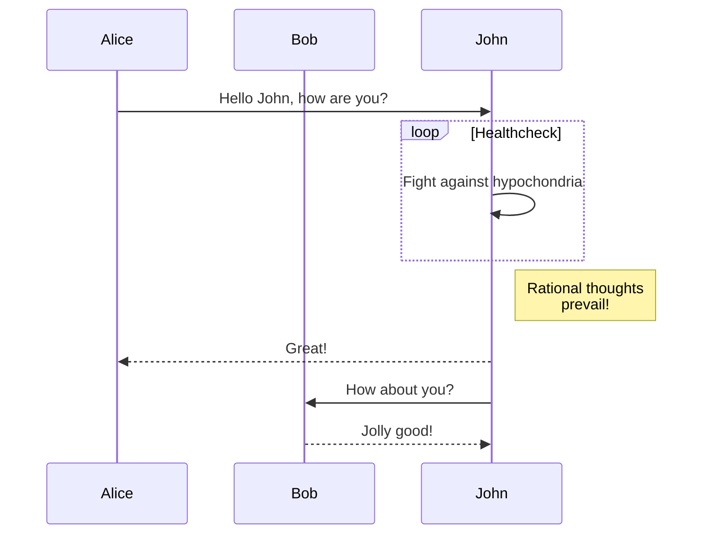

# Introduction
J'ai quand même l'impression que c'est nettement plus facile d'écrire ce blog en markdown !

## Exemple
Le _code_ est plus joli !


String toto = "toto";
System.Out.println(toto);


> Et je peux faire ça !

